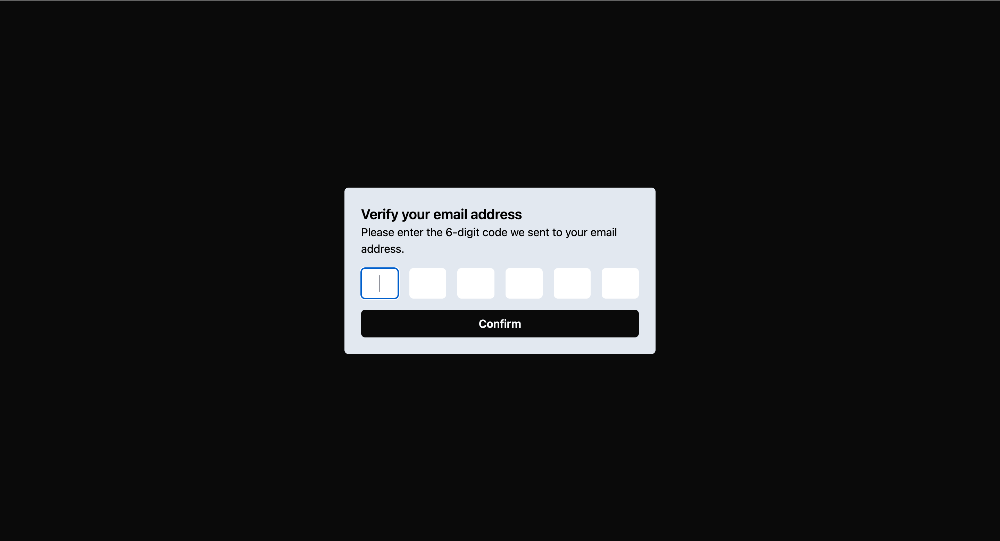

# Building and Testing an OTP UI Component with React and TypeScript



## Table of Contents

- [What You'll Learn](#what-youll-learn)
- [Installation](#installation)

## Branches

- **starter**: Contains the initial setup and minimal code to get started.
- **final**: Contains the completed code after following the tutorial.

## What You'll Learn

- The basics of building a One-Time Password (OTP) UI Component with React and TypeScript.
- How to leverage React Hook Form and Zod for front-end validation.
- How to use Jest to test user interactions with your component.

## Installation

Here's how you can get this project up and running on your local machine:

1. Create your directory:

   ```sh
   mkdir otp-react-ts
   ```

2. Change to your directory:

   ```sh
   cd otp-react-ts
   ```

3. Clone the repo:

   ```sh
   git clone https://github.com/internetdrew/otp-react-ts-jest-aws.git .
   ```

4. Install dependencies:

   ```sh
   npm install
   ```

5. Run the development server:

   ```sh
   npm run dev
   ```

6. Open [localhost:5173](http://localhost:5173) in your browser to see your updates live with hot reloads.
